```{r setup, include=FALSE}
knitr::opts_chunk$set(echo = TRUE)
```

## Introduction

Suite aux crises multiples qui ont secoué le monde de la finance et de l'assurance notamment celle de 2008, les autorités se sont rendu compte de l'insuffisance de la supervision prudentielle. Cette dernière s'est montrée très chétive lors de la crise d'où la nécessité de mettre en place de nouvelles dispositions prudentielles plus robustes.

C'est dans ce contexte, à l'image de *Bâle 2* pour la finance, que la *Solvabilité 2* voit le jour dans le milieu de l'assurance. Cette réforme réglementaire européenne vient renforcer la précédente en adaptant au mieux les exigences de fonds propres des compagnies d'assurances et de réassurances aux risques qu'elles encourent.

Les insuffisances évoquées n'ont pas épargné le cadre prudentiel marocain. C'est ainsi que l'Autorité de Contrôle des Assurances et de la Prévoyance Sociale (ACAPS[^1]) a adopter la norme de Solvabilité Basé sur les Risques (SBR) afin de tenir compte de la diversités des risques encourues par les compagnies d'assurances et de réassurances marocaines. La SBR s'articule autour de trois piliers :

[^1]: <https://www.acaps.ma/fr/l-acaps/missions>

-   *Le pilier I* regroupe les *exigences quantitatives*, à savoir les règles de valorisation des actifs et des passifs ainsi que les exigences de capital et leur mode de calcul;
-   *Le pilier II* porte sur les *exigences qualitatives* et définit les règles de gouvernance et de gestion des risques, en l'occurrence l'évaluation interne des risques de la solvabilité;
-   *Le pilier III* concerne, quant à lui, les *obligations de reporting* à l'Autorité et de diffusion de l'information au public.

## Modèle LSTM appliqué au cours de l'indice MASI

Ce code est utilisé pour créer et entraîner un modèle de réseaux de neurones récurrents (RNN) appelé Long Short-Term Memory (LSTM) pour prédire le dernier cours de l'indice MASI à partir des données historiques.

Voici une explication étape par étape du code :

1.  Les bibliothèques nécessaires sont importées, notamment pandas pour la manipulation des données, matplotlib pour la visualisation des résultats, et TensorFlow pour la création et l'entraînement du modèle LSTM.

2.  Le fichier CSV contenant les données historiques est lu à l'aide de la fonction `pd.read_csv()`, et les données sont stockées dans un DataFrame appelé `df`.

3.  Deux fonctions, `convert_num()` et `pct_to_num()`, sont définies pour convertir les valeurs des colonnes en nombres. La première fonction est utilisée pour enlever les espaces, les points et les virgules et convertir les valeurs en nombres décimaux. La deuxième fonction est utilisée pour enlever les espaces, les virgules et les signes de pourcentage, puis convertir les valeurs en nombres décimaux.

4.  Les fonctions de conversion sont appliquées aux colonnes appropriées du DataFrame à l'aide de la méthode `applymap()`.

5.  Les données sont préparées pour l'entraînement du modèle. Les colonnes pertinentes du DataFrame (`Dernier`, `Ouv.`, `Plus Haut`, `Plus Bas`) sont extraites et converties en tableaux NumPy. Les données sont ensuite normalisées à l'aide de la classe `MinMaxScaler` de scikit-learn, ce qui les met à l'échelle entre 0 et 1.

6.  Des séquences de données sont créées pour l'entraînement du modèle. Chaque séquence contient les 5 observations précédentes en tant qu'entrée et la valeur du cours "Dernier" à la prochaine observation en tant que sortie. Cela permet d'entraîner le modèle à prédire le cours futur en fonction des observations passées.

7.  Les données sont divisées en ensembles d'entraînement et de test. 95% des données sont utilisées pour l'entraînement et 5% sont réservées pour les tests.

8.  Le modèle LSTM est défini à l'aide de la classe `Sequential` de Keras. Il est composé de trois couches LSTM avec une couche de dropout entre chaque couche pour éviter le surapprentissage. La dernière couche est une couche dense avec une seule unité qui prédit la valeur du cours "Dernier".

9.  Le modèle est compilé avec l'optimiseur Adam et la fonction de perte "mean_squared_error" pour mesurer l'erreur de prédiction.

10. Le modèle est entraîné sur les données d'entraînement à l'aide de la méthode `fit()`. Le nombre d'époques est défini à 100 et la taille du lot est définie à 30.

11. Le modèle est utilisé pour faire des prédictions sur les données de test à l'aide de la méthode `predict()`. Les prédictions sont inversées à l'échelle originale à l'aide de la méthode `inverse_transform()` de l'objet `scaler`.

12. L'erreur de prédiction est évaluée en calculant la racine carrée de l'erreur quadratique moyenne (RMSE) entre les valeurs de test réelles et les valeurs prédites.

13. Les valeurs réelles et prédites sont tracées à l'aide de la bibliothèque matplotlib pour visualiser les performances du modèle.

En résumé, ce code utilise un modèle LSTM pour prédire le dernier cours du MASI à partir des données historiques, puis évalue les performances du modèle en calculant l'erreur de prédiction et en traçant les résultats.

```{python eval = F}
import pandas as pd
import matplotlib.pyplot as plt
import tensorflow as tf
from tensorflow.keras.models import Sequential
from tensorflow.keras.layers import Dense, LSTM, Dropout
import numpy as np

#Lecture du fichier csv
df = pd.read_csv('Moroccan All Shares - Données Historiques.csv')

# Conversion en nombres
def convert_num(x):
    x = x.replace(" ", "")
    x = x.replace(".", "")
    x = x.replace(",", ".")
    return float(x)

# Conversion des pourcentages en nombres
def pct_to_num(x):
    x = x.replace(" ", "")
    x = x.replace(",", ".")
    x = x.replace("%", "")
    return float(x)

# Appliquer les fonctions de conversion aux colonnes appropriées
df_temp = df.loc[:, ~df.columns.isin(["Date", "Variation %","Vol."])].applymap(convert_num)
df.loc[:, ~df.columns.isin(["Date", "Variation %","Vol."])] = df_temp
df["Variation %"] = df["Variation %"].apply(pct_to_num)


# Préparer les données
# Supposons que df est un dataframe contenant les données historiques
# avec les colonnes suivantes: Date, Dernier, Ouv., Plus Haut, Plus Bas, Vol., Variation %
# On va utiliser les 5 dernières observations comme entrées du modèle
# et prédire le cours Dernier à la prochaine date

# Convertir les données en numpy arrays
X = df[['Dernier','Ouv.',' Plus Haut', 'Plus Bas']].to_numpy()
y = df["Dernier"].to_numpy()

# Normaliser les données
from sklearn.preprocessing import MinMaxScaler
scaler = MinMaxScaler()
X = scaler.fit_transform(X)
y = scaler.fit_transform(y.reshape(-1, 1))

# Créer des séquences de données
# Chaque séquence contient 5 observations consécutives (timesteps) comme entrée
# et le cours Dernier à la prochaine observation comme sortie
X_seq = []
y_seq = []
timesteps = 5
for i in range(timesteps, len(X)):
  X_seq.append(X[i-timesteps:i])
  y_seq.append(y[i])
X_seq = np.array(X_seq)
y_seq = np.array(y_seq)

# Diviser les données en train et test sets
train_size = int(len(X_seq) * 0.95)
X_train, X_test = X_seq[:train_size], X_seq[train_size:]
y_train, y_test = y_seq[:train_size], y_seq[train_size:]

# Définir le modèle RNN
model = Sequential()
model.add(LSTM(units=50, return_sequences=True, 
               input_shape=(X_train.shape[1], X_train.shape[2])))
model.add(Dropout(0.2))
model.add(LSTM(units=50, return_sequences=True))
model.add(Dropout(0.2))
model.add(LSTM(units=50))
model.add(Dropout(0.2))
model.add(Dense(units=1))

# Compiler le modèle
model.compile(optimizer='adam', loss='mean_squared_error')

# Entraîner le modèle
model.fit(X_train, y_train, epochs=100, batch_size=30)

# Faire des prédictions
y_pred = model.predict(X_test)
y_pred = scaler.inverse_transform(y_pred) # Revenir à l'échelle originale

# Évaluer le modèle
from sklearn.metrics import mean_squared_error
rmse = np.sqrt(mean_squared_error(scaler.inverse_transform(y_test), y_pred))
print('RMSE: ', rmse)

# Tracer les valeurs observées et prédites

plt.plot(scaler.inverse_transform(y_test), label='Dernier cours observé')
plt.plot(y_pred, label='Dernier cours prédite')
plt.legend()
plt.xlabel('Jours')
plt.ylabel('Dernier cours')
plt.title('Prédiction du dernier cours avec un modèle LSTM')
plt.show()
```

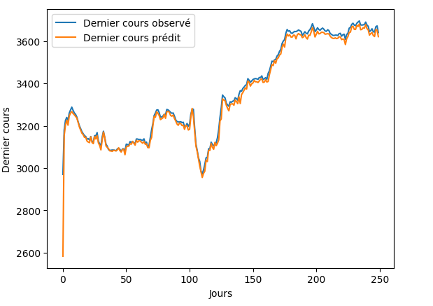{#fig-Prediction_masi2}

## Application de calcul des CSR

Dans le cadre de ce projet, nous avons développé une application permettant de calculer les capitaux de solvabilité requis. Ce calcul passe par plusieurs étapes c'est pourquoi l'application contient plusieurs onglets :

-   **Paramètres** : les paramètres généraux de l'application; \_ **Courbe des taux** : construction de la courbe des taux zéro coupon; \_ **Non-vie hors rentes** : calcul des meilleures estimations pour une apération d'assurance non vie hors rente (exemple de l'accident de travail AT);
-   **Assurance vie** : calcul des meilleures estimations pour une apération d'assurance vie (exemple d'un capital garanti dégressif en cas de décès).

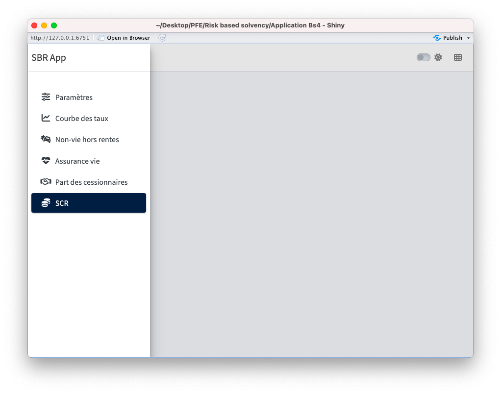{#fig-onglets}

Cette application a été développée grâce a [Shiny](https://shiny.posit.co/) et une de ses extensions [bs4dash](https://rinterface.github.io/bs4Dash/index.html). En guise d'information, Shiny est un package R qui facilite la création d'applications Web interactives directement à partir de R. Vous pouvez héberger des applications autonomes sur une page Web ou les intégrer dans des documents *R Markdown* ou créer des tableaux de bord. Vous pouvez également étendre vos applications Shiny avec des thèmes *CSS*, des widgets *html* et des actions *JavaScript*, d'où l'intervention de {bs4Dash} dans ce projet. Il permet quant à lui de créer des tableaux de bord *Shiny* avec la technologie *Bootstrap 4*. Le choix du langage R pour développer cette application est motivé par la simplicité du package shiny et de plus ce langage nous est déjà familier puisque c'est l'un des plus utilisés en sciences de données.

L'application est une agglomération de codes et de calculs, son utilisation nécessite alors de claires indications.

### Navigation dans le code source

Le dossier de l'application contient trois fichiers principaux d'extention ".R". Le premier nommé *app.R* contient la partie ui (user interface) et server de l'application. Le socond, *functions.R* détient l'ensemble des fonctions que nous avons programmé et qui sont requis dans le fichier *app.R*. Le dernier fichier sert à automatiser l'installation de tous les packages nécessaire pour faire tourner l'applciation et nous l'avons nommé *installation packages.R*.

Les commentaires ont été faits de sorte à faciliter la navigation. Peut importe le fichier, vous pouvez commencer par contracter votre code comme indiqué dans la @fig-app_R. Cette dernière est celle du code contracté du fichier *app.R*. Comme vous pouvez le constater, les titres sont assez significatifs. Vous pouvez donc étendre la partie qui vous intéresse pour avoir accès au code. Cette astuce, simple qu'elle puisse paraître, est très utile pour naviguer dans le code source sachant que le nombre de lignes est pléthoriques.

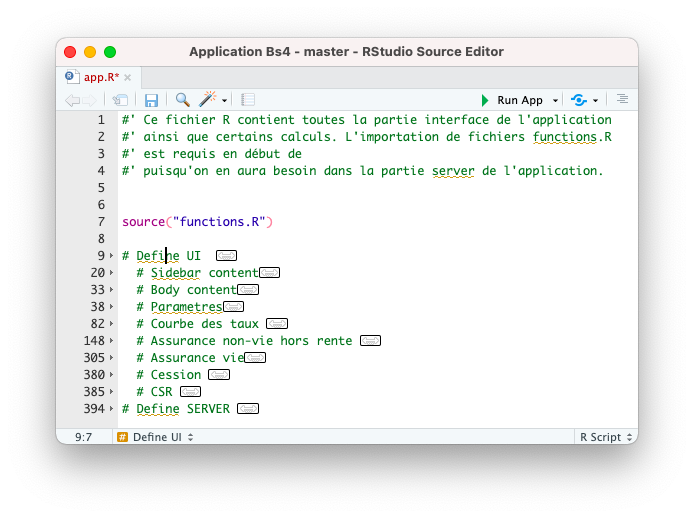{#fig-app_R}

### Paramètres

Cet onglet est dédié à la spécification de certains paramètres de la normes *SBR*. Nous avons donné des valeurs par défaut puisque l'ACAPS n'a toujours pas quantifié de manière officielle ces paramètres. Dans cet onglet on trouve :

-   **Choc de mortalité** : représente le taux de choc de mortalité que nous avons fixé à $30\%$ selon les informations disponibles.

-   **Choc de catastrophe** : taux de hausse de la mortalité due à une catastrophe naturelle. Ce taux est fixé par défaut à $0,2\%$ puisque l'ACAPS ne l'a pas encore communiqué. Par catastrophe naturelle, on sous entend une circonstance particulière telle qu'une épidémie, un tremblement de terre etc,

-   **Probabilité de défaut** : représente la probabilité de défaut des cessionnaires. Nous avons pris la valeur de $1,2\%$ qui est la praba de défaut moyenne des réassureurs sur le marché,

-   **Cession vie** : est le taux de cession des engagements dans le cadre de l'opération d'assurance vie. Ce paramètre dépend du traité de réassurance, autrement dit c'est une entrée définie par l'utilsateur de l'application et non par l'ACAPS. pour les données dont nous disposons, ce taux est de $1\%$,

-   **Cession primes non-vie** : taux de cession des primes dans l'opération d'assurance non vie qui vaut $5\%$,

-   **Cession sinistres non-vie** : taux de cession des sinistres dans l'opération d'assurance non vie qui vaut $3\%$,

-   \*\*Augmentation des FG\* : taux d'augmentation des frais de gestions valant par défaut dans notre application $14\%$;

-   **Majoration des FG** : taux de majoration des frais de gestions qui correspond au taux d'augmentation annuelle pour les années de projection. Il vaut $1,5\%$;

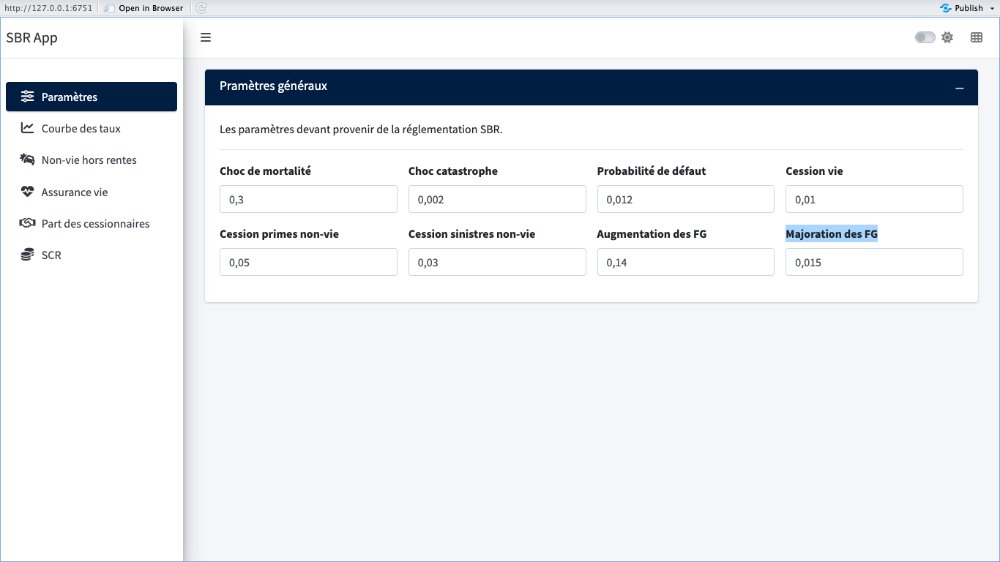{#fig-parametres}

### Courbe des taux

La construction de la courbe des taux zéro coupon est une étape cruciale du calcul de CSR. Nous avons inclus ce processus décrit dans le mémoire de fin d'étude. L'application donne la main à l'utilisateur de saisir une date de valeur, le 30 décembre 2022 pour notre étude. Cette date n'est rien d'autre que la date d'inventaire.

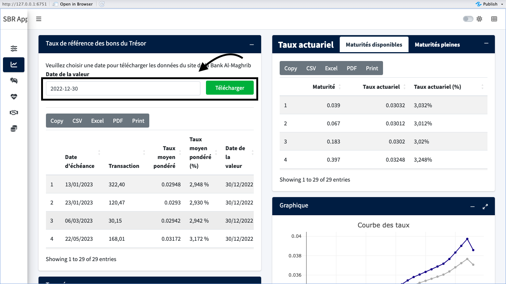{#fig-Date_zc}

En suite, l'application se charge de télécharger automatiquement la table des taux des bons de références disponibles sur le site de la Banque Centrale BAM. Cette table est alors utilisée pour faire une interpolation afin de trouver les taux correspondant aux maturités pleines. On utilise ces derniers pour calculer d'abord les taux actuariels et par ricochet les taux zéro coupon. Dans cet onglet, on peut trouver les différentes étapes suivies pour la construction de la courbe des taux zéro coupon, du téléchargement des données au boostraping. De plus, toutes les tables sont exportables sous format pdf, excel, ou csv.

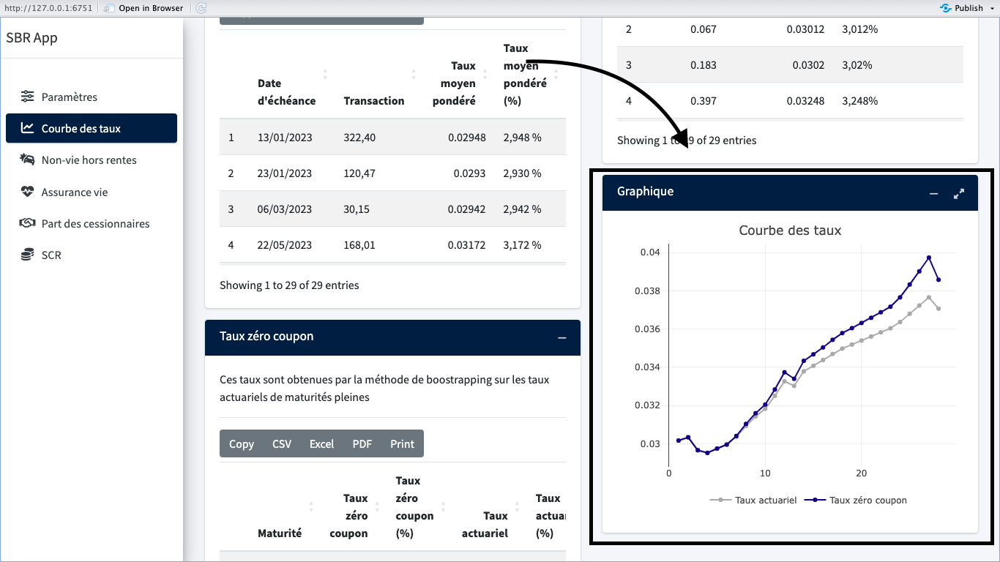{#fig-tzc_app}

{#fig-tzc}

Une fois la courbe construite, nous allons l'utiliser dans la suite de notre application pour le calcul des tous les flux futurs actualisés dont nous aurons besoin.

### Opérations d'assurance non-vie hors rente

Pour cette opération, l'entreprise d'accueil a mis à notre disposition une base de données sur l'assurance Accident de Travail (AT). Il s'agit d'un triangle de règlements cumulés d'une assurance AT.

```{r echo=FALSE, warning=FALSE,message=FALSE}
#| label: tbl-triangleAT
#| tbl-cap: Triangle de réglements cumulés d'une assurance AT

library(readxl)
library(kableExtra)
triangleAT <- read_excel("Application Bs4/Data/triangleAT.xlsx")
triangleAT%>% 
  kbl() %>% 
  kable_material(c("striped"))

```

Notre application donne à l'utilsateur l'option de selectionner manuellement le triangle, au cas où ce dernier n'est pas cumulé, l'utilsateur peut cocher sur la case *Voulez vous cumuler le triangle ?* avant de confirmer la lecture (voir @fig-import). Les autres paramètres de cette fenêtre sont des paramètres généraux d'importation de données commun à tous les langages de programmation.

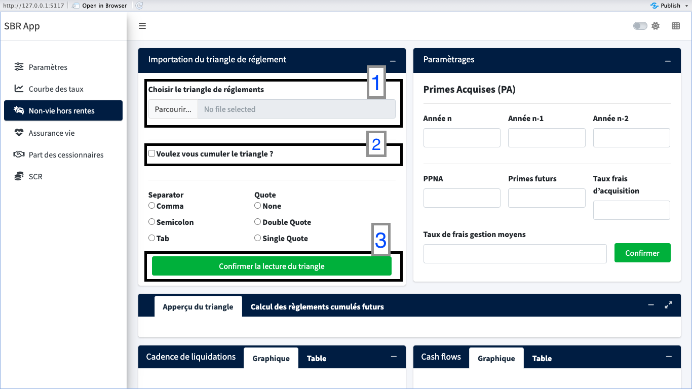{#fig-import}

En plus du triangle, cet onglet de l'application a besoin des donnèes d'entrée telles que :

-   **Primes Acquises (PA)** : nécessaire pour le calcul du ratio de sinistralité qui pour rappel vaut $RS = \frac{\sum\limits_{i=n-2}^{n}CU_i}{\sum\limits_{i=n-2}^{n}PA_i}$ où CU représente les charges ultimes,

-   **PPNA** : provision pour primes non acquises à la date d'inventaire,

-   **Primes futurs** : le montant unique des primes futurs,

-   **Taux de frais d'acquisition** : Le taux de frais d'acquisition en assurance est le pourcentage de frais prélevé par l'assureur sur chaque versement effectué par l'assuré

-   **Taux de frais gestion moyens**

La @fig-parametrage donne un aperçu de l'endroit où ces paramètres sont requis et le @tbl-parametrage représente les données historiques de PA et PPNA dont nous avons besoin.

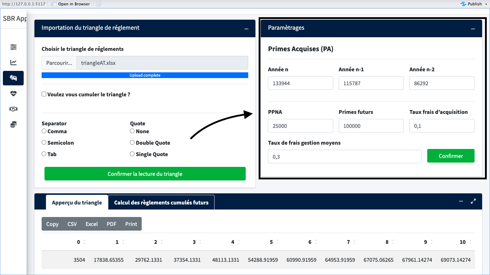{#fig-parametrage}

```{r echo=FALSE, warning=FALSE,message=FALSE}
#| label: tbl-parametrage
#| tbl-cap: Données de PA et PPNA

library(readxl)
library(kableExtra)
pam <- read_excel("Documents/Rapport-PFE_files/Data/parametrage.xlsx")
pam%>% 
  kbl() %>% 
  kable_material(c("striped"))

```

L'application supporte le calcul des meilleures estimations des engagements une fois tous les paramètres de cet onglet sont renseignés.

##### Meilleure estimation des engagements pour sinistres avec Chain Ladder {.unnumbered}

En suivant les étapes mentionnées à la méthode de Chain Ladder, on a obtenu les facteurs de développements présenté dans le tableau @tbl-fdev.

```{r tbl-fdev,echo=FALSE, warning=FALSE,message=FALSE}
#| label: tbl-fdev
#| tbl-cap: Les facteur de développements
library(kableExtra)
fdc = data.frame(
        fdc1 = c(37312),
        fdc2 = c(16890),
        fdc3 = c(13263),
        fdc4 = c(11770),
        fdc5 = c(11161),
        fdc6 = c(10585),
        fdc7 = c(10450),
        fdc8 = c(10234),
        fdc9 = c(10176),
       fdc10 = c(10164)
      )
fdc = fdc/10000
fdc%>% 
  kbl() %>% 
  kable_material(c("striped"))

```

Ces facteurs sont ensuite utilisé pour remplir le triangle inférieur par la méthode de Chaine Ladder pour obtenir les règlements futurs (table ci-après @tbl-regF) cumulés dont la dernières colonnes représente les charges ultimes.

```{r echo=FALSE, warning=FALSE,message=FALSE}
#| label: tbl-regF
#| tbl-cap: Réglements futurs cumulées
library(readxl)
library(kableExtra)
reglfutur = read_excel("Documents/Rapport-PFE_files/Data/reglFutures.xlsx")

reglfutur%>% 
  kbl() %>% 
  kable_material(c("striped"))

```

On en déduit facilement les flux de règlements futurs en faisant la sommes des élments du triangle inférieur décumulé. Par suite, on obtient les cashflows pour les 10 années de projections suivants :

```{r echo=FALSE, warning=FALSE,message=FALSE}
#| label: tbl-cash
#| tbl-cap: Flux de règlements futurs (Cafh Flows)
library(readxl)
library(kableExtra)
cash = read_excel("Documents/Rapport-PFE_files/Data/cash.xlsx")

cash%>% 
  kbl() %>% 
  kable_material(c("striped"))

```

Une actualisation des cash flows de la @tbl-cash par la courbe des taux zéro coupon s'opère automatiquement par l'application pour effectuer le calcul de la meilleure estimation des engagements pour sinistres :

$$
BES = 213\;799\; \text{MAD}
$$

##### Meilleure estimation des engagements pour prime ($BEP$) {.unnumbered}

Pour le calcul de la $BEP$, nous avons besoin du ration de sinitralité ($RS = \frac{\sum\limits_{i=n-2}^{n}CU_i}{\sum\limits_{i=n-2}^{n}PA_i}$). Notre application calcule ce ratio à partir des PA données en input puisque nous disposons déjà des charges ultimes, qui, nous le rappelons, correspondent aux éléments de la dernière colonne de la @tbl-regF. Ainsi nous obtenons les paramètres suivants :

```{r echo=FALSE, warning=FALSE,message=FALSE}
library(kableExtra)
par2 = data.frame(
  stringsAsFactors = FALSE,
                Parametre = c("RS","PPNA",
                              "Primes futurs","Taux de frais d'acquisition"),
            Valeur = c("0,698546111", "25000", "100000", "0,1")
       )

par2%>% 
  kbl() %>% 
  kable_material(c("striped"))
```

Après détermination des cadences de liquidation, nous trouve comme meilleure estimation des engagements pour prime :

$$
BEP = -16\;907\; \text{MAD}
$$

Ce résultat négatif s'explique par le montant des primes primes futurs. En effet, du fait que cette prime soit unique et importante, au moment de l'inventaire, l'asssureur a encaissé plus qu'il ne doit décaisser d'ici 10 ans pour les engagements correspondants. Par conséquent, puis que la meilleure estimation correspond à la différence entre les décaiseement et les encaissements, alors c'est pourquoi la $BEP$ est négative.

```{r echo=FALSE, warning=FALSE,message=FALSE}
library(kableExtra)
cad = data.frame(
  stringsAsFactors = FALSE,
             Cad.0 = c("7,78%"),
             Cad.1 = c("21,25%"),
             Cad.2 = c("20,00%"),
             Cad.3 = c("16,00%"),
             Cad.4 = c("11,51%"),
             Cad.5 = c("8,88%"),
             Cad.6 = c("5,00%"),
             Cad.7 = c("4,07%"),
             Cad.8 = c("2,21%"),
             Cad.9 = c("1,70%"),
            Cad.10 = c("1,61%")
      )

cad %>% 
  kbl() %>% 
  kable_material(c("striped"))
```

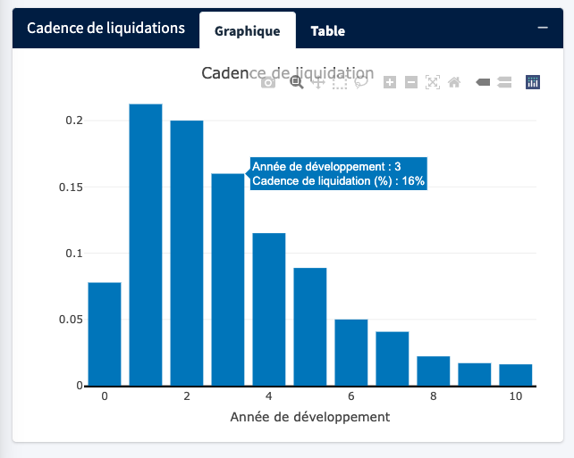

##### Meilleure estimation des frais de gestions ($BEFG$) {.unnumbered}

Le taux moyen des trois dernières années des frais de gestions étant de $3\%$, on aboutit au résultat :

$$
 BEFG = 59\;067\;\text{MAD}
 $$

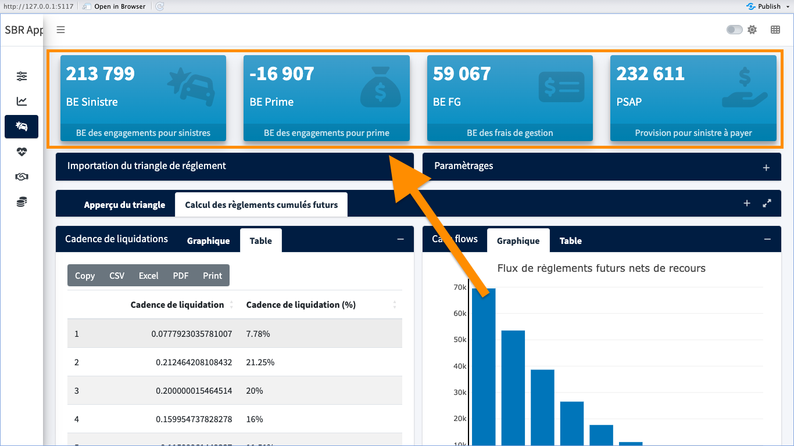

### Opérations d'assurance vie

Dans ce projet nous avons étudié le cas d'un capital décès dégressif. Ce dernier est un type de capital versé aux bénéficiaires d'une assurance décès qui diminue progressivement avec le temps, jusqu'à atteindre un capital nul. Ce type de capital est utile pour couvrir un besoin financier important lors des premières années de l'assurance (hypothèque, crédit, enfants à charge, etc.) et qui diminue au fil du temps. Comme dans le cas du triangle, l'utilisateur de notre application peut parcourir son ordinateur afin de sélectionner la table de données qui doit contenir au moins les colonnes suivantes :

-   **Age de l'assuré**,
-   **Année d'effet du contrat**,
-   **Durée du contrat**,
-   **Durée restante du contrat**,
-   **Le capital initial**.

L'utilisateur doit sélectionner les colonnes mentionner sous-dessus puis renseigné les frais de gestions unitaire moyen qui est de $100$ pour notre étude.

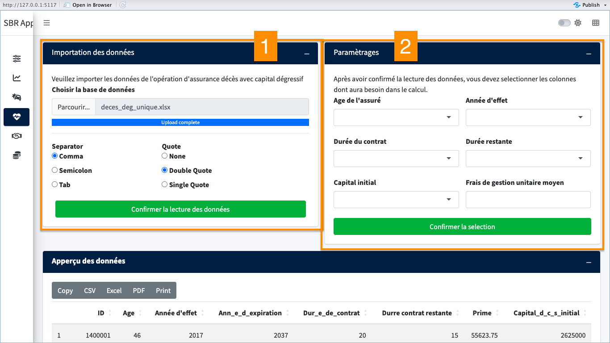{#fig-dec_import}

```{r echo=FALSE, warning=FALSE,message=FALSE}
#| label: tbl-dec_table
#| tbl-cap: Données du Capital décès dégressif (CDD)
library(kableExtra)
cdd = data.frame(
        stringsAsFactors = FALSE,
             check.names = FALSE,
                      ID = c(1400001L, 1400002L, 1400003L),
                     Age = c(46L, 43L, 35L),
         `Année.d'effet` = c(2017L, 2017L, 2014L),
      Ann_e_d_expiration = c(2037L, 2042L, 2039L),
        Dur_e_de_contrat = c(20L, 25L, 25L),
  Durre.contrat.restante = c(15L, 20L, 17L),
                   Prime = c(55624, 94684, 4113),
   Capital_d_c_s_initial = c(2625000, 1785000, 262500)
)

cdd %>% 
  kbl() %>% 
  kable_material(c("striped"))

```

#### Tableau d'amortissement {.unnumbered}

Le capital étant dégressif, il est primordial de voir comment se capital est amorti tout au long de la durée du contrat. Voici un exemple d'ammortissemnt d'un contrat de durée $25\;ans$, de date d'effet 2017, de capital initial $1\;785\;000\;\text{MAD}$. Le montant des annuités vaut $114\;261\;\text{MAD}$ sachant que le taux d'intérêt est de $4\%$.

```{r echo=FALSE, warning=FALSE,message=FALSE}
#| label: tbl-amort
#| tbl-cap: Tableau d'amortissement
#| tbl-subcap: CRP désigne le capital restant à payer en cas de décès
library(kableExtra)
amort =  data.frame(
                   Annee = c(2017L,2018L,2019L,
                             2020L,2021L,2022L,2023L,2024L,2025L,2026L,
                             2027L,2028L,2029L,2030L,2031L,2032L,2033L,
                             2034L,2035L,2036L,2037L,2038L,2039L,2040L,
                             2041L,2042L),
                     CRP = c(1785000L,1742139L,
                             1697563L,1651204L,1602991L,1552849L,1500702L,
                             1446468L,1390066L,1331407L,1270402L,1206957L,
                             1140974L,1072351L,1000984L,926762L,849571L,
                             769293L,685803L,598974L,508671L,414757L,317086L,
                             215508L,109867L,0L),
                Intérêts = c(71400L,69686L,
                             67903L,66048L,64120L,62114L,60028L,57859L,55603L,
                             53256L,50816L,48278L,45639L,42894L,40039L,
                             37070L,33983L,30772L,27432L,23959L,20347L,
                             16590L,12683L,8620L,4395L,0L),
           Amortissement = c(42861L,44576L,
                             46359L,48213L,50142L,52147L,54233L,56403L,58659L,
                             61005L,63445L,65983L,68622L,71367L,74222L,
                             77191L,80279L,83490L,86829L,90302L,93915L,
                             97671L,101578L,105641L,109867L,0L),
                 Annuité = c(114261L,114261L,
                             114261L,114261L,114261L,114261L,114261L,114261L,
                             114261L,114261L,114261L,114261L,114261L,
                             114261L,114261L,114261L,114261L,114261L,114261L,
                             114261L,114261L,114261L,114261L,114261L,114261L,
                             0L)
         )

amort %>% 
  kbl() %>% 
  kable_material(c("striped"))

```

Ce calcul se fait automatiquement par l'application à partir de la table de données.

#### Projection du capital ammorti {.unnumbered}

Maintenant que nous disposant du capital amorti pour la durée du contrat, l'étape qui s'en suit est de déterminer la valeur probable de ce capital. On sait que ce capital sera versé qu'en cas de décès de l'assuré. Alors, pour une année $j$ de projection de donnée, le capital restant ($VPC$) est versé que si l'assuré d'âge $x$ survit jusqu'à l'année $j-1$ et décède à l'année $j$. En terme mathématiques :

$$
VPC = _{j-1}p_x \times q_{x+j}*CRP_i
$$

#### Résultats et interprétations {.unnumbered}

L'onglet dédié à cette opération d'assurance de capital décès dégressif, après tout calcul, fournit les résultat suivants :

```{r echo=FALSE, warning=FALSE,message=FALSE}
#| label: tbl-bevie
#| tbl-cap: Meilleure estimation des granatie probabilisée et des frais de gestions
library(kableExtra)
bevie =  data.frame(
                   `Meilleure estimation des garanties probabilisées` = c("183 895 103"),
                   `Meilleure estimation des frais de gestions` = c("3 725 418"),check.names = F
         )

bevie %>% 
  kbl() %>% 
  kable_material(c("striped"))

```

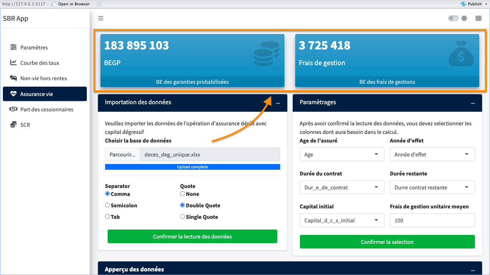

### Part des cessionnaires

La part des cessionnaires est déterminées conformément aux spécification techniques de l'ACAPS. Les taux de cession sont fournis dans l'onglet paramètres et peuvent être modifiés en fonction du traité de réassurance correspondant à l'étude :

-   **Taux de cession des engagements vie** : $1\%$,

-   **Taux de cession primes non-vie** : $5\%$,

-   **Taux de cession sinistres non-vie** : $3\%$.

La meilleure estimations des engagements pour primes non-vie étant négative, on s'attend aussi à une cession négative des primes.

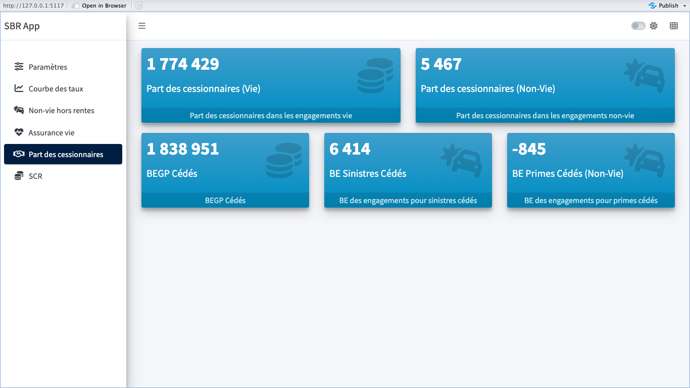{#fig-cession}

### Capital de solvabilité requis

En tenant compte des paramètres renseigné dans le premier onglet ainsi que de tous les calculs effectués dans les autres onglets, il en ressort les capitaux de solvabilité requis pour les risque de souscription vie et non vie indiqué à la figure suivante :

```{r echo=FALSE, warning=FALSE,message=FALSE}
#| label: tbl-csr_vie_non
#| tbl-cap: CSR Souscription
library(kableExtra)
csr =  data.frame(
  stringsAsFactors = FALSE,
                 X = c("CSR Souscription vie", "CSR Souscription non-vie"),
                 y= c("52 496 918", "197 616")
)

csr = t(csr)
rownames(csr) = NULL

csr %>% 
  kbl() %>% 
  kable_material(c("striped"))

```

```{r echo=FALSE, warning=FALSE,message=FALSE}
#| label: tbl-csr_sousrisk
#| tbl-cap: CSR Sous-risques
library(kableExtra)
csr =  data.frame(
  stringsAsFactors = FALSE,
                 X = c("CSR mortalité", "CSR catastrophe", "CSR frais"),
                 Y = c("52 485 959", "353 884", "1 012 563")
)

csr = t(csr)
rownames(csr) = NULL

csr %>% 
  kbl() %>% 
  kable_material(c("striped"))

```

```{r echo=FALSE, warning=FALSE,message=FALSE}
#| label: tbl-RM
#| tbl-cap: Marges de risques
library(kableExtra)
csr =  data.frame(
  stringsAsFactors = FALSE,
                 X = c("Marge de risque non-vie", "Marge de risque vie"),
                 Y = c("9 338 125", "19 965 000")
)

csr = t(csr)
rownames(csr) = NULL

csr %>% 
  kbl() %>% 
  kable_material(c("striped"))

```

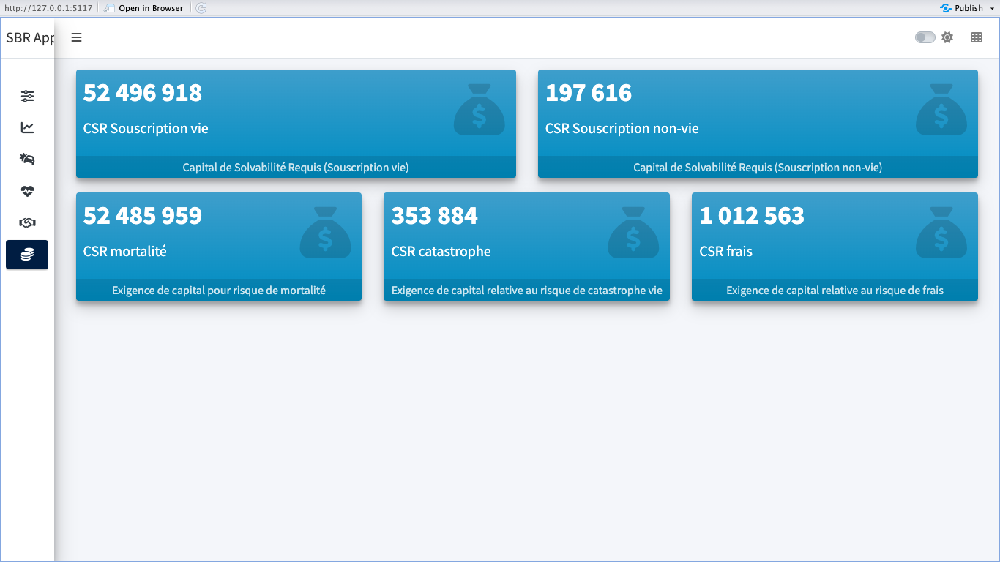{#fig-csr}

Nous avons supposé que les sous risques sont indépendants entendant la publication de la matrice de corrélation entre ces sous-risques.
